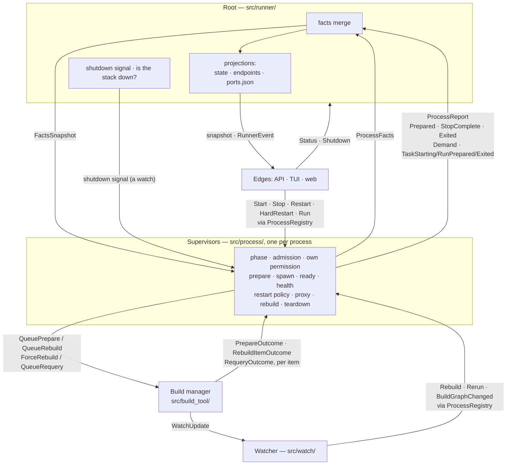
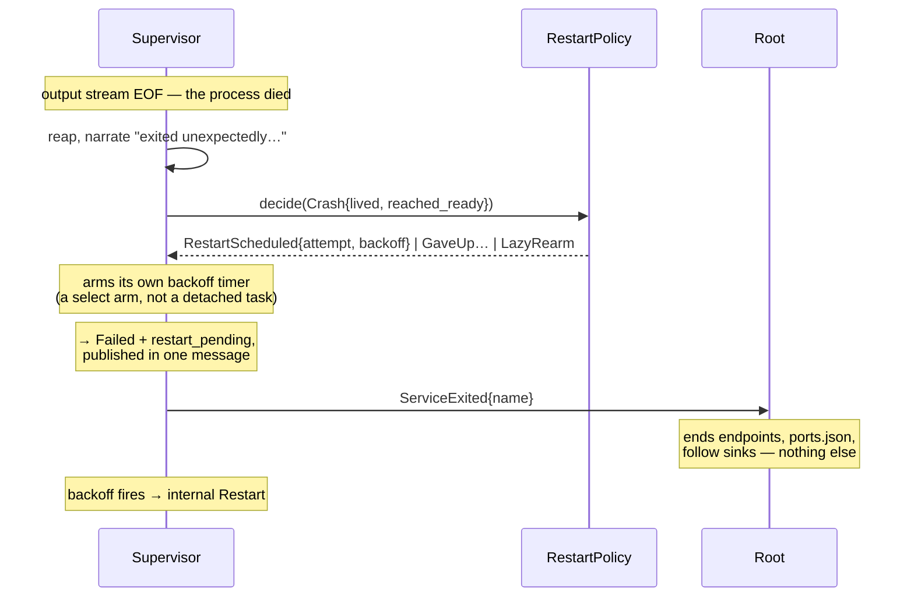
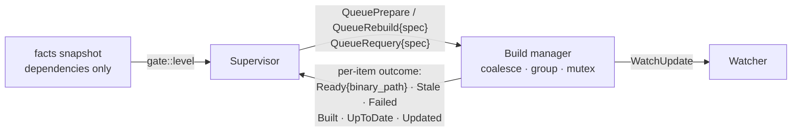

# Who owns what

Don is four cooperating actors, plus one per process for its output. This
document says what each one owns, what it may never do, and what the signals
between them are. It exists because the
boundaries erode in one specific way: someone needs a fact, notices another
component already has it, and reads it from there — and a year later nobody
can answer "why did X restart?" without reading every module.

> **The invariant, stated once:**
> **Commands flow down. Reports flow up. Peers never command peers.**
>
> Addressed commands into a process come only from the edges (API, TUI,
> watcher), via `ProcessRegistry` — so "who can stop a service?" stays a
> two-line grep. Processes report transitions; anything that cares *observes*.
> A supervisor never holds another process's handle.

## The actors

`src/runner/` is deliberately **not** called the scheduler any more, because it
does not schedule anything. It is the root: it builds the stack, owns the
lifetimes it created, merges what every process says about itself, and answers
the whole-stack questions no single process can. Every decision about a process
belongs to that process.

| Actor | Owns | Must never |
|---|---|---|
| **Root** (`src/runner/`) | construction (bind proxies fail-fast, PID file, spawn supervisors, own the watcher and build manager), the facts merge, the state/endpoint/ports projections, the event broadcast, "is the whole stack up / down?" | hold a pid, a handle or a port binding; decide any process's phase; decide when a process starts, restarts or stops |
| **Supervisor** (`src/process/`) | one process end to end: **its phase**, its admission, its own permission to run, prepare, spawn, ready check, health monitor, restart policy, its proxy, its rebuild cycle, and when it tears itself down | command a peer; import anything from `runner` |
| **Build manager** (`src/build_tool/`) | *every* build — the first as much as a rebuild: coalescing across processes, workspace grouping, the bazel mutex, watch-path and binary-path resolution and the registrations they produce, the mtime scan that catches an edit made mid-build | know about dependencies or lifecycle state |
| **Watcher** (`src/watch/`) | file watching, debounce, watch registrations | decide what a change *means*, or track what it started |

A fifth actor is per-process but not a supervisor: **`src/output/actor.rs`** owns
one process's ring buffer, sink list and attach registration. It is what makes
"first attaching client mutes stdout" a single message rather than a comment
about which mutations must share a lock.

## A process's phase belongs to its supervisor

Every service phase — `Pending`, `Building`, `Starting`, `Running`, `Ready`,
`Unhealthy`, `Stopping`, `Stopped`, `Failed`, `Lazy`, `DependencyFailed` — and
every task phase is decided and published by the supervisor that owns the
process, in `PhaseOwner` / `TaskPhaseOwner`. The root holds no process state at
all: `RuntimeService` is the resolved config, `RuntimeTask` is the config plus
the two values read out of `.don/task-state` to seed its supervisor. `don
status` reads the merge.

That deleted the fold. `service_health.rs` is down to one function about
projections, `service_ready.rs` to one, `startup.rs` to two dependency
predicates and one whole-stack question. `HealthChanged`, `ServiceReady`,
`ServiceStarting` and `ArtifactBuild` are gone entirely — there was nothing left
for anyone to do with them — and `ServiceExited` carries only a name.

It also deleted the *guards*. `handle_service_starting` used to reject a start
its supervisor had already committed to; the ready fold used to drop a report
whose service had moved on. Both existed because two actors held one fact. There
is one holder now, so there is nothing to reconcile.

Satisfaction is published rather than derived, and that is load-bearing for
tasks: a `Completed` task with an outstanding re-run does **not** satisfy its
dependents, and whether it does depends on its run history, its `auto_run`
policy and whether it declares params a file change cannot supply. All three
live in its supervisor. Publishing the conclusion is what stops every dependent
needing to understand every kind of dependency.

### Three rules this cost us, learned the hard way

**Facts that are read together must be published together.** A supervisor
published `Failed` and then, as a second message, "a retry is armed". The root
absorbed the first, asked "is anything still coming up?", got no, and tore the
stack down. `PhaseOwner::transition` publishes phase and `restart_pending` in
one message. The old fold got this for free by being single-threaded; a
publisher has to be deliberate about it.

**The merge must not route its own updates through its own queue.** While the
root still owned task phase it both sent to the channel and applied
synchronously — so a later drain re-applied a copy that had since been
superseded, reverting the snapshot and re-emitting a phase the task had already
left. Tests saw each task transition twice.

**A signal you only poll is a signal you sleep through.** The teardown check
sits at the top of the supervisor's idle loop, but until the shutdown watch was
also a `select!` arm the supervisor only reached it when some unrelated event
happened to wake it — in one test, 137 seconds later.

## Permission is computed, not granted

`src/facts.rs` is what every dependency question is now answered from. Each
process publishes what it says about itself — its phase, whether a dependent
may treat it as up, whether waiting on it will ever end, what it is stranded
behind — and the merge turns those into one `FactsSnapshot`.

A supervisor then answers **its own** "may I run?" by calling
`gate::level(&its own depends_on, &snapshot)`. Nothing publishes permission.
The root is not on the path between a dependency becoming ready and a
dependent starting.

Three consequences worth stating, because each deleted something:

- **The revision stamp is gone.** It existed because demand lived in the
  supervisor and permission in the root, so a supervisor could hold fresh
  demand and a stale level. Both are now read by the same loop at the same
  instant, so there is no window for them to disagree.
- **One snapshot, not a value per peer.** A process depending on `db` and
  `cache` must see both as of one instant. Reading them from separate channels
  admits a torn read, and acting on one starts a service whose dependency is
  mid-restart.
- **Publishing is deduplicated at both ends.** Facts flow in a cycle — publish,
  merge, dependents recompute, some publish. A republish that changed nothing
  must not count as a change, or N supervisors spin forever. The dependency
  graph is a validated DAG, so a real change settles in at most `depth` rounds.

### What decentralising cost

Cross-process command ordering is no longer free. The old single
command loop used to order *everything*: restart `setup`, then connect to a
lazy service depending on it, and the fold saw those in that order by
construction. Now the restart goes to `setup`'s mailbox and the connection to
`api`'s, and nothing sequences the two.

This is a real semantic change, not a bug to paper over — in wall-clock terms
the two events genuinely race. What must hold is narrower: once a process has
*published* that it is no longer satisfied, no dependent may start against it.
That holds, because the snapshot is read at the moment demand is spent.

`integration_lazy_dep_rerun_failure_after_startup_blocks_start` pinned the old
accidental guarantee. It was also silently broken — it waited for a marker that
appeared in the echoed `spawn bash -c '...'` line during startup, so it never
waited for the rerun at all, and passed only because the fold serialised the
two commands anyway. The marker is now split so it appears only in the task's
own output.

Two of these edges are enforced by `tests/module_edges_test.rs` rather than by
convention: `src/process/` must not reference `crate::runner`, and neither
must `src/tui/`. Both erode the same way — by reaching for a runner type that
already has the fact you want.

## Signals



The watcher is an **edge**, not a stage: it addresses supervisors through the
same registry the API and the TUI use. So does every verb — every pre-check they
need (`cannot start while Stopping`, `already running`, `not running`,
`waiting for dependency 'x'`, `task is already running`, and whether the
supplied params resolve) is about the phase a supervisor published, the process
it holds, the config it was built from, or the level it computes.

There is no bulk verb. `don run --all-pending` used to broadcast a sweep that
every task answered about itself; it was removed rather than kept, because a
caller that wants several tasks run can name them, and the sweep's aggregate
narration was the root speaking on everyone's behalf about work it was not
doing — the same reason "killing N running tasks" went.

Two things are left in the root's mailbox, and neither is about a single
process: `Status`, because verbose status resolves ready checks and watch paths
the projection deliberately does not carry, and `Shutdown`.

Nothing comes back from the build manager to the root either. Every kind of
batch — preparation, rebuild, re-query — is cross-item to *run* and per-item in
its *consequences*, so all three fan out to the supervisor that asked.

What still reaches the root is bookkeeping: reports that carry a client's reply
or that end a projection spanning process generations. They travel on one
**lossless unbounded mpsc**, not the broadcast, because the merge must never lag
its own inputs. The broadcast is for peers and edges, which resync from the
snapshot when they lag.

### Two ordering rules the split created

Publishing and reporting are separate channels, so their order is a contract,
not an accident:

1. **A supervisor publishes its facts before sending any report about the same
   event**, and narrates before publishing anything that unblocks a dependent.
   Publishing is what releases the processes waiting on you; a line emitted
   afterwards lands behind the "starting..." it was meant to explain.
   Terminal task facts carry `report_pending` until the exit report is queued,
   so a task-only stack cannot exit in the gap between those channels. Clearing
   it publishes another update, waking a root that already consumed the report.
2. **The root drains facts before handling any report or command.** Both
   channels are unbounded, so by the time a report is dequeued the facts behind
   it are already queued. That is what makes "`don stop` returned" imply "no
   longer a satisfied dependency" for the very next command.

## A start, end to end

```mermaid
sequenceDiagram
    participant Root
    participant Sup as Supervisor
    participant Proc as Process

    Note over Sup: reads the facts snapshot:<br/>every dependency satisfied
    Note over Sup: spends its one-shot demand<br/>(a level alone would double-start)
    Note over Sup: → Starting, published
    Sup->>Proc: spawn
    Note over Sup: → Running + pid, published
    Sup->>Root: ServiceStartPrepared{wired: ports}
    Note over Root: endpoints, ports.json;<br/>answers the client's reply
    Sup->>Sup: ready check, against its own proxy/docker state
    Note over Sup: → Ready, published; says what it probed
```

The root never says *when* and never says *how*, and no longer says *what state
this is in*. It learns the pid from the facts the supervisor published and
projects it — it keeps no copy of its own.

## A crash



Whether a service starts again is the supervisor's answer, because every input
the question needs — did the prepare fail, did the ready check pass, how long
did this spawn live — is something it observed itself. The root folds enough to
keep its projections honest and nothing more.

Two rules the crash path depends on:

- **Demand is one-shot.** A level alone double-starts: dependencies are
  satisfied, the process dies instantly, they are still satisfied, and an idle
  supervisor starts again at zero backoff. Demand is cleared in the same synchronous step that begins the
  start. A restart the policy scheduled arrives as its own mailbox command and
  does not consult demand — *a crash is not a request*.
- **The reset flag is load-bearing.** An explicit stop or restart clears the
  failure history; the policy's own retry must not, or the streak that bounds
  a crash loop is wiped by every attempt it schedules.

## Ending a process

The same rule as starting one, taken all the way: **nothing sequences
teardown.** The root raises one signal. Every supervisor sees it and waits for
*its own* dependents to be holding nothing before ending what it holds, so
reverse-dependency order emerges from the graph rather than being walked. The
graph is a validated DAG, so something always has no dependents and goes first.
`crate::process::await_dependents_gone` is the whole mechanism.

The escalation is the escape: a second Ctrl+C is published as a watch that
every supervisor is racing against — it cuts both the grace period *and* the
wait for dependents. The root's whole contribution is one "forcing immediate
shutdown" line.

The predicate a supervisor waits on is **custody, not phase**:
`ProcessFacts::holds_nothing()`. That is deliberately uniform across kinds. A
task ends `Completed` or `Failed`, never `Stopped`, and a service can sit in
`Failed` with its process still alive under `on_failure = "notify"`. Custody is
the fact; the phase is commentary. It also stays true of a process whose
supervisor has already ended and will publish nothing further.

> A cancelled task run is the sharp edge here. Its exit status describes the
> SIGKILL, not the task, so nothing about it is folded — but it still publishes
> that it let go of the process. *Whether the exit means anything* and *whether
> this supervisor still holds something* are different questions, and teardown
> waits on the second. A run that stayed silent held the whole stack open.

What the root still owns is the question no single process can answer — is the
stack down? — which it reads from the merge it already maintains, and the
lifetimes it created: the build manager, the update checker, the supervisor
tasks. There is a 30s backstop, but it is a backstop: every grace period is
already bounded and a second Ctrl+C collapses them all.

This is why `src/runner/` contains no `killpg`, no topological sort for
shutdown, and no stop order at all.

## Rebuilding

A watched file changing means "these paths moved", and nothing more. The
watcher debounces, says so, and forgets it — it has no idea whether a rebuild
followed, whether one was already running, or how it went.

The supervisor owns the cycle end to end, which is what lets it answer the
question the watcher used to: a change arriving while a cycle is running does
not start a second one, it marks the artifact that cycle is about to produce
already stale, and the cycle queues its own follow-up when it ends. That
distinction is `RebuildSource` — a change coalesces, a rebuild asked for by
name supersedes.

> **Nothing reports that a rebuild finished.** There is no completion event,
> because there is no longer anyone waiting to hear about one. `RebuildComplete`,
> `TaskRerunComplete`, `RebuildCycleDone` and the watcher's own `Rebuilding`
> state all existed to close a loop that the cycle's owner now closes itself.

Task re-runs are the same shape. Whether a watched change means a run depends
on `auto_run`, on whether the task declares params a file change cannot
supply, and on whether its artifact is still building — three facts the task's
own supervisor has.

## Building

Startup, lazy JIT and rebuild are one sentence: *a supervisor that needs an
artifact asks the build manager for one.*



The root does not appear in it. It learns that a build is running the
way it learns everything else — from a report — and folds it into `Building`
so `don status` can say so, so `initial_startup_settled` stays open while one
runs, and so a rebuild requested mid-build is deferred rather than raced. It
never decides that a build should happen, and the gate means only what
`src/gate.rs` says it means.

The load-bearing detail:

> **Dependencies gate *running*, not *building*.**

An artifact can be built before its dependencies are up — bazel does not care
whether postgres is listening. So a supervisor requests its build **when it is
constructed**, not when its dependencies become satisfied. Tasks first check
whether startup will run them: manual tasks, unchanged watched inputs, and
already-completed once tasks request no artifact. Runnable tasks queue their
artifacts before waiting for dependencies. Every eligible supervisor asks up front, the
debounce window coalesces them, and bazel gets one invocation for the whole
workspace. Building only once dependencies were satisfied would serialise builds along the
dependency chain, which is the one real regression this ordering avoids by
construction.
Lazy services are the exception for the reason that makes the rule: nothing
wants one yet, so its supervisor asks on first demand.

One request is late by construction, and it is why nothing builds the instant
`Runner::new` returns. Watch paths are resolved *by* these builds and have to
reach the watcher before anything spawns — but the watcher does not exist
until the runner has set it up. The build manager parks preparation requests
until the runner says `WatchReady` and every task has finished its startup
check. This keeps slow input hashing in the same initial batch. Later explicit
task runs still request a fresh build. A supervisor then waits for its outcome
before spawning, so the registrations are always in place first.

### Two rules that come with it

**Build failures do not retry; runtime failures do.** Retrying a compile that
just failed recompiles the same broken code. The restart policy exists for
crashes, unhealthy probes and ready-check failures — things where waiting can
plausibly change the answer. A supervisor whose build fails withdraws its own
demand, so the failure never reaches `RestartPolicy` at all; only an explicit
request by name starts that process again.

**The startup mtime scan survives.** `run_batch_build_chain` stamps a
timestamp before building and afterwards checks whether any watched source or
BUILD file is newer, reporting `PrepareOutcome::Stale` — "you edited a file
while the build was running, so build again before starting". That looks like
the rebuild cycle's staleness flag but cannot be merged with it: the cycle
learns staleness from the *watcher*, and during this build nothing is watching
those paths yet, because the watch paths are resolved **by that build**. The
mtime scan is the only thing covering that bootstrap window. It lives in the
build manager with the rest of the chain, and the supervisor answers it by
asking again.

**A re-query is a build too.** A changed BUILD file means the watch patterns
resolved from it may be wrong, so the supervisor asks for a re-query the same
way it asks for anything else. The manager coalesces them, registers the paths
it resolves — it resolved them, so it delivers them — and answers each
supervisor with the one part that needs lifecycle: whether the process running
now was built from a graph that has since moved.

## Reading state

A status query must never queue behind whatever the root is doing, so
reads go through projections rather than the command channel:

- **`state_store.rs`** — every process's `ProcessStatus`, plus
  `startup_complete`. `StateWriter` is not `Clone` and lives on the root;
  `StateReader` is cloneable and read-only. For runtime detail the snapshot
  *is* the record, not a copy of one — pid, docker-ness and port mappings live
  only in `ProcessStatus::Service.runtime`.
- **`endpoints.rs`** — where every service can be reached. Supervisors render
  their own `$(peer.KEY)` env from it at start time, which is why a peer that
  moved is picked up without the request being reissued.
- **`facts.rs`** — what every process says about itself, merged into one
  snapshot. Every dependency question in the stack is answered from it.
- **`gate.rs`** — the pure functions over that snapshot: `level`,
  `failed_roots`, `skipped_non_blocking`. No state of its own.
- **`output/actor.rs`** — one process's buffered output, its sinks and its
  attach registration, answered by that process's own output actor.
  `output/attach.rs` and `watch/report.rs` are the read paths onto it and onto
  the watcher.

The state store and the `RunnerEvent` broadcast update on exactly the same
transitions, which is what lets a consumer that missed an event resync from
the snapshot and get a consistent answer.
